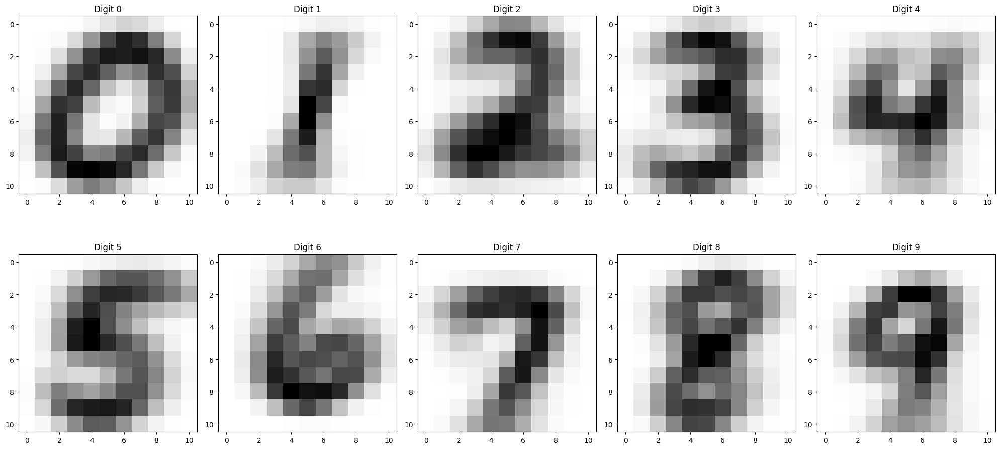

# MCM-Classifier
This is an experimental MCM-based naive Bayes' classifier. It is a very simple classifier that uses fitted Minimally Complex Models to classify new data. More information on MCMs and the way they're fitted can be found [here](https://github.com/clelidm/MinCompSpin), [here](https://github.com/clelidm/MinCompSpin_Greedy) and [here](https://github.com/ebokai/MinCompSpin_SimulatedAnnealing).

## Requirements and dependencies
The code requires you to have Python installed. Any version of Python 3 should work, but using the latest version is recommended. In order to select MCMs, you should also have the [simulated annealing](https://github.com/ebokai/MinCompSpin_SimulatedAnnealing) (SA) code installed, which requires C++ to be installed. You should also change the relative paths in that code to match the paths for this code. On Mac, these are the places you should change if you have mcm_classifier in the same folder as SA:
- `src/data.cpp`: line 7, change `"../input/data"` to `"../" + fname + ".dat"`.
- `src/main.cpp`: lines 39 and 40, change `"../output/comms + fname + "_comms.dat";` to `"input/MCMs/" + fname.substr(fname.find_last_of("/\\") + 1) + "_comms.dat";` and `"../output/stats" + fname + "_stats.dat";` to `"output/stats/" + fname.substr(fname.find_last_of("/\\") + 1) + "_stats.dat";` respectively.

This classifier also depends on the following packages:
- NumPy (comes installed with pretty much any Python distribution): `pip install numpy`
## Usage
### Input data
In order to use this classifier, one should have:
- A *uniform* dataset, with each row being a sample and each column being a feature, separated per label and numbered accordingly (e.g. `train-images-unlabeled-0_comms.dat` for the first label, `train-images-unlabeled-1_comms.dat` for the second label, etc.). The data is expected to be inside the `INPUT` folder.
- A set of labels, one for each sample in the dataset. This is solely used to measure the performance of the classifier. The labels are expected to be inside the `INPUT` folder.
- The communities of a fitted MCM for each label, assumed to be in the `INPUT/MCMs` folder. In order to select your MCMs, I'd recommend using the [simulated annealing](https://github.com/ebokai/MinCompSpin_SimulatedAnnealing) selection method.

In `main.py`, one has to set the number of labels present in the dataset, as well as the number of features. Finally, you should name all files according to the format defined above (i.e. replace `"train-images-unlabeled-{}_comms.dat"` with anything else so it matches your filenames, and place the `{}` in the place where your number is in the filename.)

### Running the classifier
Once you have all the data, you can run the classifier by simply running `main.py`. The user is free to edit the code to their liking, but the default settings should work fine.

There are a couple of methods you can call on the classifier:
- `classifier.init()`: initializes the classifier with already selected MCMs in the `INPUT/MCMs` folder. If the MCMs are not already fitted, you can use the `classifier.fit()` method to fit them to the data.
- `classifier.fit()`: fits the MCMs to the data, and saves them to the `INPUT/MCMs` folder. In the sample code, there is no need to call this method, as the MCMs are already fitted. However, if you want to use your own data, you should call this method first. This method also initializes the classifier. Optional fitting parameters are documented in the code.
- `classifier.classify(state)`: classifies a single state and returns the predicted label along with the probabilities the state belongs in each category.
- `classifier.evaluate(data, labels)`: evaluates the classifier on a given dataset and returns the predicted classes and probabilities for each sample. The `data` parameter should be a list of states, and the `labels` parameter should be a list of labels, one for each state in the `data` list. The predicted classes and probabilities are returned in the same order as the `data` list.
- `classifier.sample_MCM(n_samples)`: samples `n_samples` states from each MCM and returns them in a list.
- `classifier.get_classification_report(labels)`: Generates a classification report for the classifier, using the given labels as the true labels. The classification report is returned as a dictionary containing the following items: `precision`, `recall`, `f1-score`, `accuracy`, `avg_precision`, `avg_recall` and `avg_f1_score`.
- `classifier.save_classification_report(labels, name, path)`: Saves the classification report to a file `path/name.txt`

### Sample data
In case you have no data to use, you can use the sample data provided in the `INPUT` folder.
This is sample data from the [MNIST dataset](http://yann.lecun.com/exdb/mnist/). As MCMs only support binary datasets with 128 or less features, this data was pre-processed by cutting of the edges coarse graining the images into 11x11 binary matrices, where 1 means a given pixel is lit, and 0 means it isn't. The 'average' image for each digit is shown below.

The [simulated annealing](https://github.com/ebokai/MinCompSpin_SimulatedAnnealing) method has been applied to this dataset and using the resulting MCMs results in an accuracy of approximately 90%.